# Make it POP!

 
 (klik op de afbeelding om een video te zien)

### What is Make it POP! ?

Dit is een teken uitdaging dat is geinspireerd door een tekentechniek dat ik heb gebruikt tijdens modeltekenen. 
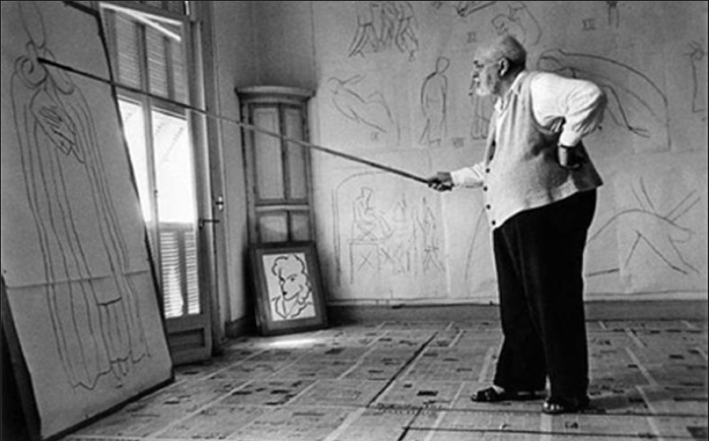  

Hier bij daag ik u uit. Start de code (see "How to Use) en ga met uw hand 1m ongeveer van de webcam staan. Klik op spatie om te starten en maak een lijn tekening met één hand zichtbaar voor de camera. En als je het duft maak een vuist "to Make it POP!" 
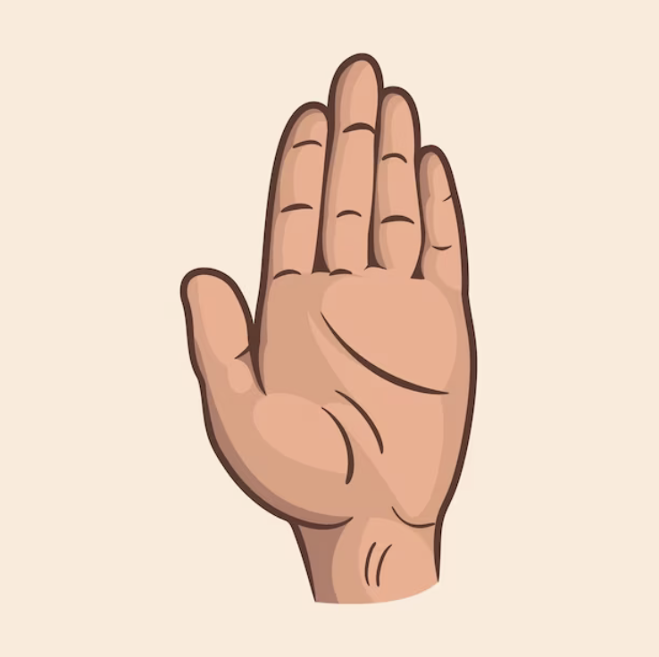 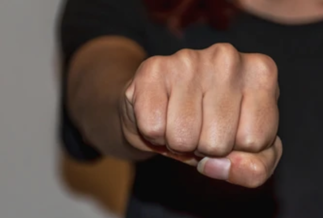  

Ik heb dit gamaakt om mijzelf met 2 dingen te helpen arm en schouderbeweging en om weer terug creatief bezig te zijn. Daardoor heb ik hiervan een simpel mini game van gemaakt dat u creatief uitdaagt en dat bijna iedereen kan doen.

### How to Use

Het opstarten van de code is vrij simpel. Als eerste is natuurlijk de code clonen van github.  
`git clone https://github.com/Bannos77/make.it.POP.git`

Dan lijkt het mij handig om hiervan een vite project te maken.  
`npm create vite@lates`

Als je dat hebt gedaan ga je nog een drie dingen copy pasten voor de python code.  
`pip install opencv-pytho` `pip install pyautogui` `pip install mediapipe`

Eenmaal je dit hebt gedaan kan je zegmaar de code gebruike. Dit ga ga je doen door bij de terminal of powershell `npm run dev` in te zetten voor een locale host te maken. Dan ga je de python code open in Visual Studio Code en klik je op de play button rechts bovenaan voor de python te activeren. En als laatste open je de localhost link je gekozen webbrowser.

<ul>Mogelijke problemen dat je kan tegen komen: 
<li>Zie dat je kan connecten aan een webcam om de python code te gebruiken.</li>
<li>Volgende is kijken hoe ver je de camera sensor wil gebruiken en verander in de code als het moet (standaard staat op +/- 1m) Anders zal het clicken met je hand moeilijk gaan. (bekijk Python om te zien hoe je dit moet veranderen)</li>
<li>Zorg ervoor dat de camera maar een hand ziet anders weet hij niet welke hand hij moet gebruiken als muis en flipt die een beetje.</li>
</ul>

## The Code

De code is ingedeeld in 4 hoofdstukken. Ik ga bij elke hoofstuk uitleggen wat ze doen en code eruit highlighten dat extra uitleg nodig heeft.

### HTML

De html is is niet al te ingewikkeld en bijna spreekt voorzich. Toch ga ik het een beetje uitleggen. De `
` is vooral u start pagina en legt uit wat je hoe je het spel moet spelen. Daarna komt de `
` en deze zocht voor de animaties en draw functies. 
Natuurlijk komt de 2 scripts hierna. De eerste is is voor de animatie en de tweede is de script waar wij aan kunnen knoeien en werken.

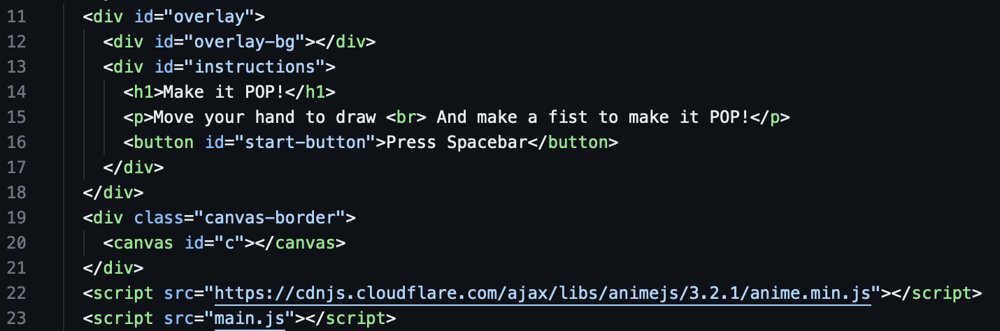
 
 

### CSS

De css is vooral voor de start pagina. Dit gaat vooral over de `overlay` overgang animatie en hoe de tekst en startknop eruitziet. 
Dat is niet alles er is een klein stukje voor de `canvas` en dat is de canvas size. 
Hier kan je vooral knoeie aan de font size, welke font de tekst aantoont en de knop om het persoonlijker te maken.
 
 

### JAVASCRIPT

Nu komt de grote stuk van de code. Deze heb ik al voor jullie zelfs in de code zelf ingedeeld in hoofdstukken dat titels heeft met wat wat doet om dit geen info dump te worden. 
Toch ga ik er een paar stukjes eruithalen dat toch extra info nodig heeft. 
Als eerste zal ik de hoofstuk 6. Event Handling bespreken. 
Ik haal deze naarboven omdat het niet echt voorzich spreekt wat het doet maar simpel weg dit zorgt voor de pop animaties dat de lijn tekening weghaalt en alles van kleur laat veranderen.

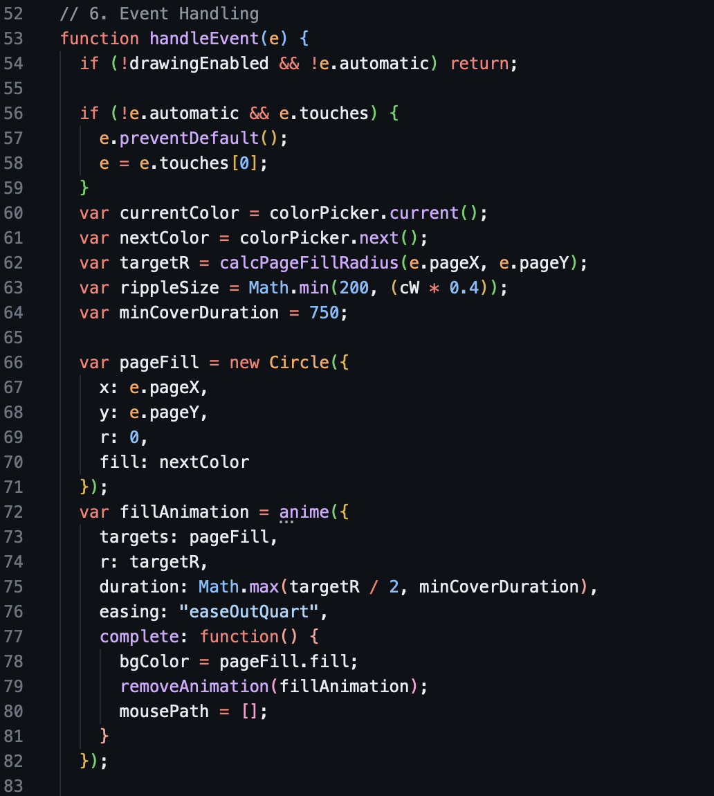  

Volgende zal ik hoofstuk 12. Animation Loop naarboven halen. 
Deze zegt ook niet echt wat het doet. Dit is de lijn dat vormt nadat je je muis od hand beweegt. Hier kan je ook de dikte van de lijn veranderen als je `ctx.lineWidth = 5;` groter of kleiner maakt.

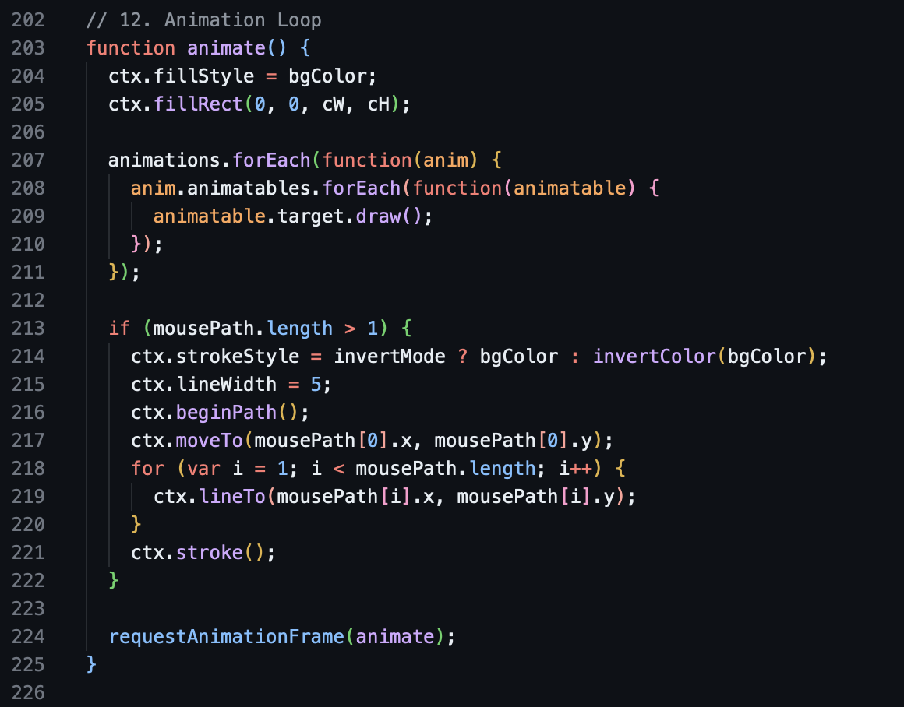  

Deze hoofstuk heb ik er iets bij extra gezet om de gemak te verbeteren 14. Start Button Handling 
En dat is de manier om op de spatiebalk te drukken als het niet lukt om met uw hand de startknop te drukken.

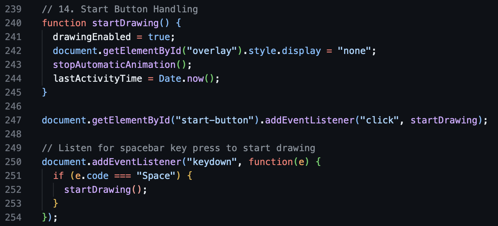  

En als laatste haal ik naarboven hoofdstuk 16. Inactivity Check. 
deze zit erin als de persoon klaar is en weg is. Gaat de webpagina na 30 seconden inactiviteit heropladen. Dit zorgt ervoor dat mensen niet binnen komen bij een blanko scherm of een scherm met lijnen. 

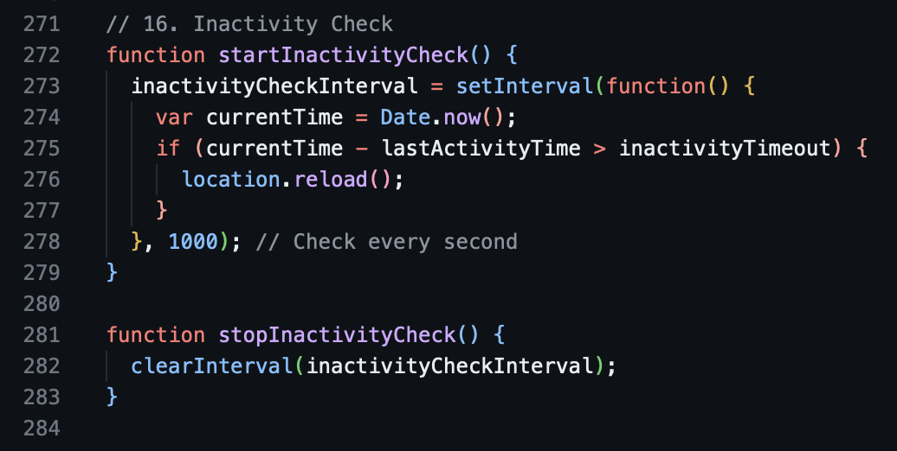  

Als je de lengte van inactivety wilt veranderen doet dat aan de top van de code bij `var inactivityTimeout = 30000;`. Hier kan je de lengte korter of langer maken.

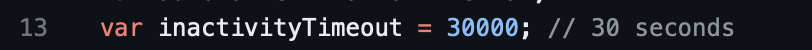
 
 

### PYTHON

Bij de python code heb ik hetzelfde gedaan als bij de javascript. Elke gedeelte van de code dat iets doet heb ik een titel gegeven. Dus ik ga een beetje hetzelfde doen als bij de vorige gedeeldte en ga stukken code eruithalen dat ik een beetje extra uitlag wil geven. 
Als eerste zullen we een belangrijke naarvoren halen en dat heeft de titel: Distance threshold for detecting a fist. 
Deze stuk code zorgt ervoor dat je met een vuist kan klikken. En hoe groter de nummer de dischterbij de camera je moet zijn.

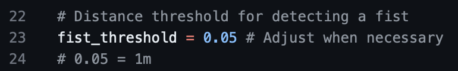  

Volgende is misschien handig om te weten op voorand en dat heeft de titel: Track thumb tip and control mouse movement. 
Dit stukje code is hoe we onze muis kunnen laten bewegen. Ik heb ervoor gekozen dat de muis de duim volgt. Dit kan je altijd vervangen door de `id == 4:` van 4 naar een andere punt te veranderen.

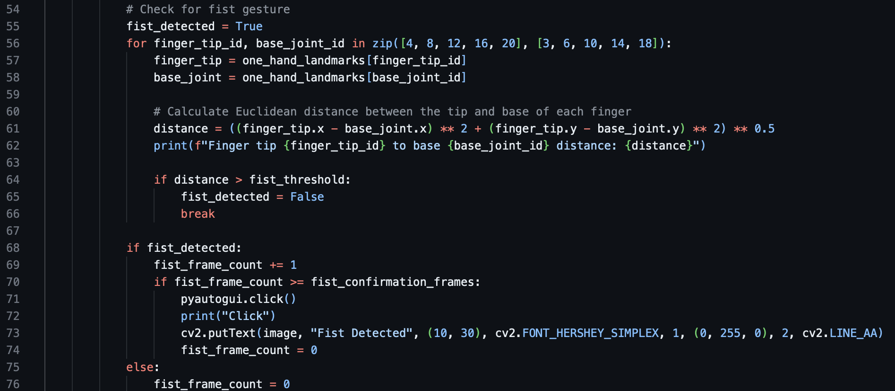  

Ook wil ik iets kort uitleggen bij: Check for fist gesture. 
In dit stukje code heb ik het zo gezet dat als de vuist dicht is gaat hij klikken. Om te voorkomen dat dat heel snel gebeurt heb ik er nog een soort van conofrmation systeem bijgezet. Dit komt door frames controleren.

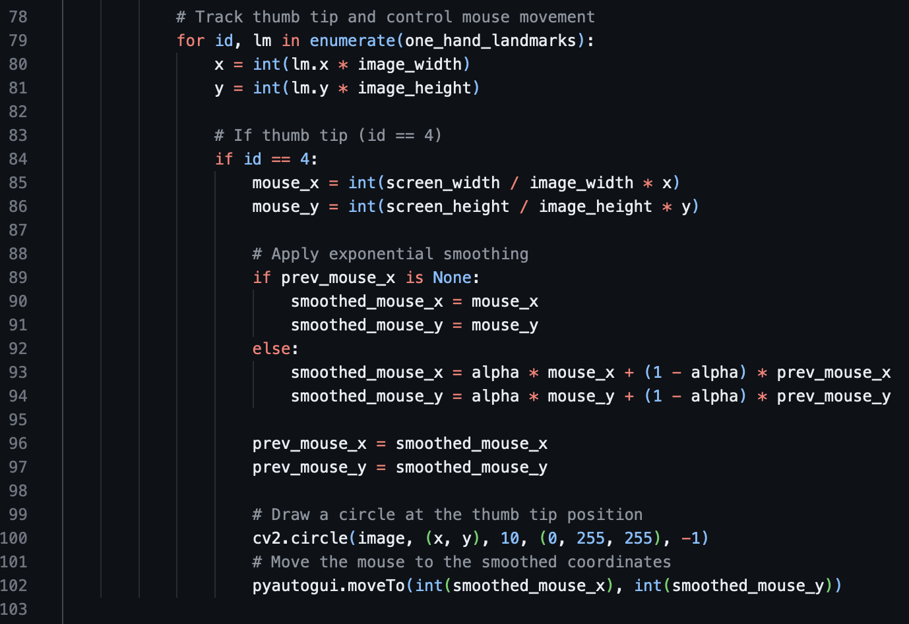  

Dit kan je ook veranderen in de hoofdstuk: Number of consecutive frames to confirm a fist gesture. Hier kan je de nummer hogerzetten als het klikken te snel gaat of lager als het te traag gebeurt.

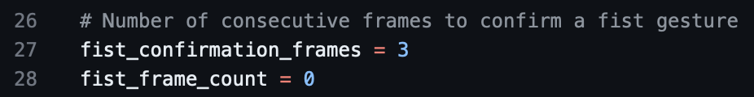  

### Codes used to make this code

[Video handgesture mouse control](https://www.youtube.com/watch?v=nOoKjMvvvXU&pp=ygUmcHl0aG9uIGNvZGUgZm9yIGhhbmQgZ2VzdHVyZSB0byBtb3VzZSA%3D) 
[Codepen for canvas code](https://codepen.io/alexzaworski/pen/mEZvrG)
